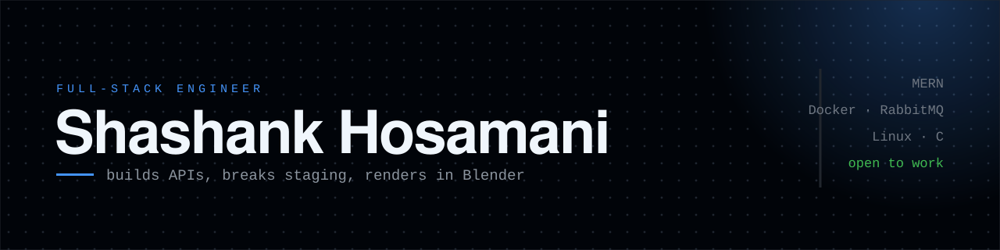

<!--
  Shashank Hosamani — profile README (design 2a)
  Replace every YOUR_* placeholder before committing.
-->

<!-- BANNER -->

  

<!-- Animated typing headline -->

  

  I like the messy middle — APIs, queues, deploys, and the occasional 3D render at 2am. 
  Currently open to full-time roles and freelance builds.

  
  
  
  

---

### 🧰 Tech I reach for

---

### 📌 Things I've built

<table>
  <tr>
    <td width="50%" valign="top">
      <h4><a href="https://github.com/Shashankhosamani/expense-app">expense-app</a> &nbsp;</h4>
      
Reads bank SMS and files your transactions automatically — no manual entry.

      
<code>React</code> <code>Node</code> <code>MongoDB</code>

    </td>
    <td width="50%" valign="top">
      <h4><a href="https://github.com/Sourabha123-gokavi/PES1UG21CS557_PES1UG21CS579_PES1UG21CS597_PES1UG21CS608_Microservices-communication-using-RabbitMQ">rabbitmq-microservices</a> &nbsp;</h4>
      
Inventory system split into services that talk over a message queue.

      
<code>Docker</code> <code>AMQP</code>

    </td>
  </tr>
  <tr>
    <td width="50%" valign="top">
      <h4><a href="https://github.com/Shashankhosamani/OS-Task-Lister-using-Kernel-Module">OS-Task-Lister</a> &nbsp;</h4>
      
Linux kernel module that walks every live task from init downward.

      
<code>C</code> <code>Linux</code>

    </td>
    <td width="50%" valign="top">
      <h4><a href="https://github.com/Shashankhosamani/3D-protfolio">3D-portfolio</a> &nbsp;</h4>
      
Three.js scene where the engineering brain goes off-duty. Models made in Blender.

      
<code>Three.js</code> <code>Blender</code>

    </td>
  </tr>
</table>

---

### 📊 The numbers

  
  

  

---

### Let's talk 🤝

  
  
  
  

thanks for scrolling this far ✌

